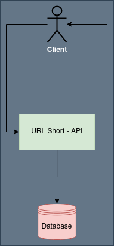
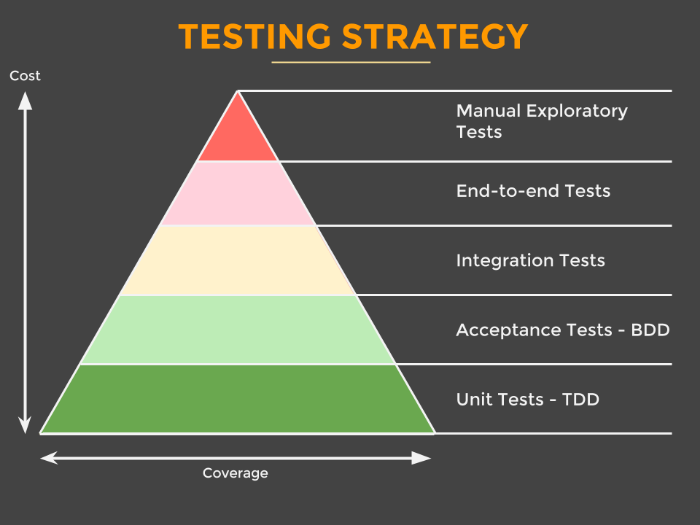

# Encurtador de URL - API

## Requisitos

### Funcionais

* Encurtamento: Dado uma URL completa, retornar uma URL mais curta. ex. https://www.loggi.com/compartilhe/corp/86b35e3a1f2bf7b8f77c7ef30c3cd159 -> https://log.gi/0bkZ2V
* Redirecionamento: Dado uma URL mais curta, retornar a URL original. ex. https://log.gi/0bkZ2V -> https://www.loggi.com/compartilhe/corp/86b35e3a1f2bf7b8f77c7ef30c3cd159

### Não funcionais

* Atender a 100 milhões de requisições por mês com taxa de crescimento constante
* Arquitetura do serviço deve atender sem nenhuma restruturação por pelo menos 5 anos
* A URL curta deve conter o menor número de caracteres possível
* Baixa latência e consistência forte são fundamentais

## Arquitetura da aplicação



## Estrutura da aplicação


Para mais detalhes: https://blog.cleancoder.com/uncle-bob/2012/08/13/the-clean-architecture.html

## Estratégia de teste



## Construindo e rodando a aplicação

* Construindo

```./gradlew clean application:configuration:build```

* Construindo uma imagem docker:  

```./gradlew jibDockerBuild```

* Subindo ambiente

```docker-compose up``` 

* Parando ambiente

```docker-compose down``` 

## Documentação da API

### Encurtamento
```http
POST http://localhost:8080/urls HTTP/1.1
Content-Type: application/json

{
    "fullAddress": "https://www.loggi.com/compartilhe/corp/86b35e3a1f2bf7b8f77c7ef30c3cd159"
}
```

Resultado

```http
HTTP/1.1 201 Created
Date: Mon, 30 Mar 2020 20:00:35 GMT
content-type: application/json
content-length: 113
connection: close

{
  "fullAddress": "https://www.loggi.com/compartilhe/corp/86b35e3a1f2bf7b8f77c7ef30c3cd159",
  "shortAddress": "5lxH1F"
}
```

### Redirecionamento
```http
GET http://localhost:8080/urls/5lxH1F HTTP/1.1
```

Resultado

```http
HTTP/1.1 200 OK
Date: Mon, 30 Mar 2020 20:03:03 GMT
content-type: application/json
content-length: 113
connection: close

{
  "fullAddress": "https://www.loggi.com/compartilhe/corp/86b35e3a1f2bf7b8f77c7ef30c3cd159",
  "shortAddress": "5lxH1F"
}
```

### Erros

Not Found
```http
HTTP/1.1 404 Not Found
Date: Mon, 30 Mar 2020 22:13:53 GMT
content-type: application/json
content-length: 87
connection: close

{
  "message": "Short URL 5lxH1c not found",
  "_links": {
    "self": {
      "href": "/urls/5lxH1c",
      "templated": false
    }
  }
}
```

Internal Server Error
```http
HTTP/1.1 500 Internal Server Error
Date: Mon, 30 Mar 2020 22:32:40 GMT
content-type: application/json
content-length: 83
connection: close

{
  "message": "Please try again",
  "_links": {
    "self": {
      "href": "/urls",
      "templated": false
    }
  }
}
```
